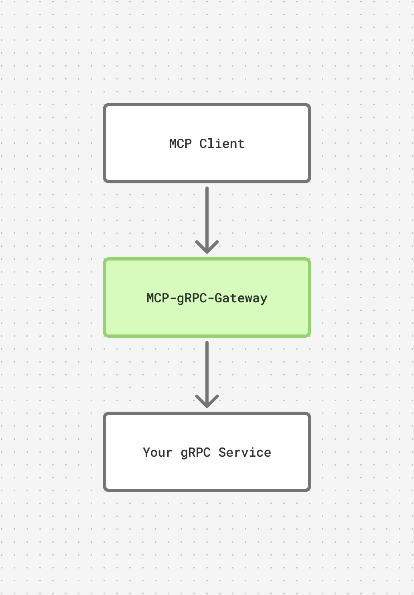

# MCP gRPC Gateway

<p align="center">
  
</p>

MCP gRPC Gateway exposes existing gRPC services as stateless MCP tools over HTTP. It connects to a downstream gRPC server, reads its live service descriptors through gRPC reflection, converts unary RPC request messages into JSON Schema tool inputs, and invokes the selected RPC when an MCP client calls the tool.

The gateway is designed for teams that already describe service contracts in protobuf and want MCP support without hand-writing a parallel tool server. Protobuf annotations can provide tool names and tool descriptions, while reflection lets the gateway reload tool definitions as services change. In practice, your gRPC service remains the source of truth and the gateway can pick up newly deployed tools without a gateway redeploy.

## Quick Start

To run this as a binary, you can run:

```bash
mcp-grpc-gateway --addr 0.0.0.0:8080 --grpc-host your-grpc-service:50051 --path "/mcp"
```

This will start a server that listens on port 8080, reads the reflected RPC definitions at `your-grpc-service:50051`, and hosts your MCP endpoint at `/mcp`.

## Local CLI

If, for whatever reason, you want to run this locally, you can use `go install` from the repository root to install it:

```bash
go install ./cmd/mcp-grpc-gateway
```

## Docker

The project publishes a distroless, non-root Docker image to Docker Hub:

```bash
docker run --rm -p 8080:8080 cadenyaagents/mcp-grpc-gateway:latest \
  --grpc-host your-grpc-service:50051
```

The runtime image has no shell or package manager and runs as a non-root user.

## Releases

GitHub releases are driven by tags. Pushing a `v*` tag runs GoReleaser, publishes release archives and checksums, pushes Docker release tags, and labels the Buf module with the same tag.

```bash
git tag v0.1.0
git push origin v0.1.0
```

For `v0.1.0`, the release workflow publishes:

```text
GitHub release: v0.1.0
Docker tags: cadenyaagents/mcp-grpc-gateway:0.1.0, :0.1, :0, :latest, :sha-<commit>
Buf label: buf.build/cadenya-agents/mcp-grpc-gateway:v0.1.0
```

## MCP Transport

This gateway only supports stateless MCP over HTTP. It mounts the MCP Go SDK's Streamable HTTP transport with stateless JSON responses, so each request is handled independently and the gateway does not issue or require `Mcp-Session-Id` headers.

The endpoint is intended for HTTP `POST` requests with JSON responses. **It does not expose stdio, stateful SSE sessions, resumable streams, or event-store backed session recovery.**

## Forwarding Headers

HTTP headers are not forwarded to gRPC by default. You can opt in to specific headers with `--forward-header`; each matching HTTP header is attached to the downstream gRPC request as metadata.

```bash
mcp-grpc-gateway \
  --grpc-host your-grpc-service:50051 \
  --service "yourapp.v1.Service" \
  --forward-header Authorization
```

Repeat the flag to allow more headers:

```bash
mcp-grpc-gateway \
  --grpc-host your-grpc-service:50051 \
  --service "yourapp.v1.Service" \
  --forward-header Authorization \
  --forward-header X-Request-ID
```

## Service Filters

By default the gateway loads all non-reflection services exposed by the downstream gRPC server's reflection API. This is useful for production servers that host multiple gRPC services on the same listener.

Use `--service` when you want to expose only specific services. The flag may be repeated, and tools from the selected services are appended into one MCP server.

```bash
mcp-grpc-gateway \
  --grpc-host your-grpc-service:50051 \
  --service "yourapp.v1.ObjectivesService" \
  --service "yourapp.v1.UsersService"
```

Tool names must be unique across all loaded services. If two RPCs produce the same MCP tool name, the first one is kept and the gateway emits a warning log with the colliding service name and tool name.

## MCP Server Metadata

MCP server metadata belongs to the gateway process, not the reflected gRPC services. A single MCP server can aggregate tools from multiple gRPC services, so service-level protobuf annotations are not used to set the MCP server name, title, version, instructions, or website URL.

Configure those values with CLI flags:

```bash
mcp-grpc-gateway \
  --grpc-host your-grpc-service:50051 \
  --mcp-name "objectives-gateway" \
  --mcp-title "Objectives Gateway" \
  --mcp-version "1.0.0" \
  --mcp-instructions "Use these tools to inspect workspace objectives." \
  --mcp-website-url "https://yourapp.example.com"
```

The same values can be set with environment variables:

```bash
MCP_NAME=objectives-gateway
MCP_TITLE="Objectives Gateway"
MCP_VERSION=1.0.0
MCP_INSTRUCTIONS="Use these tools to inspect workspace objectives."
MCP_WEBSITE_URL=https://yourapp.example.com
```

CLI flags override environment variables. By default, the gateway reports `mcp-grpc-gateway` as the MCP server name and `dev` as the version.

## Annotations

By default your RPC definitions in your gRPC endpoint will be exposed 1:1 for RPC names as tools. You can override tool names and add tool descriptions for LLMs with method annotations.

```proto
syntax = "proto3";

package yourapp.v1;

import "grpcmcpgateway/v1/annotations.proto";

service Service {
  rpc GetRecentObjectives(RecentObjectivesRequest) returns (ObjectiveObjectivesResponse) {
    option (grpcmcpgateway.v1.tool) = {
      name: "recent_objectives"
      description: "Retrieves all of the recent objectives for the workspace that is authenticated"
    };
  }
}
```

If you want developers to explicitly disclose which RPCs become MCP tools, start the gateway with `--require-tool-annotations`. In that mode, only unary RPCs with `grpcmcpgateway.v1.tool` annotations are exposed.

```bash
mcp-grpc-gateway --grpc-host your-grpc-service:50051 --require-tool-annotations
```

## Buf Examples

To use the annotations from another Buf-managed gRPC service:

1. Add the dependency to your `buf.yaml`.

```yaml
version: v2
deps:
  - buf.build/cadenya-agents/mcp-grpc-gateway
```

2. Update your Buf dependencies.

```bash
buf dep update
```

3. Import the annotations in your service proto.

```proto
import "grpcmcpgateway/v1/annotations.proto";
```

4. Add MCP tool annotations.

```proto
service ObjectivesService {
  rpc ListObjectives(ListObjectivesRequest) returns (ListObjectivesResponse) {
    option (grpcmcpgateway.v1.tool) = {
      name: "list_objectives"
      description: "Lists objectives for the current workspace."
    };
  }
}
```

## Tool Snapshot Reloads

The gateway keeps a reflected snapshot of your gRPC services and periodically reloads it. When a reload succeeds, new MCP sessions use the new tool set. When reflection fails during a rolling deploy, the gateway keeps serving the last known-good snapshot.

By default snapshots reload every minute:

```bash
mcp-grpc-gateway --grpc-host your-grpc-service:50051 --reload-interval 1m
```

You can disable background reloads by setting the interval to `0`:

```bash
mcp-grpc-gateway --grpc-host your-grpc-service:50051 --reload-interval 0
```

## Logging

The gateway logs with Go's structured `slog` package. Logs are written to stderr, with `text` output by default.

```bash
mcp-grpc-gateway --grpc-host your-grpc-service:50051 --log-level debug --log-format json
```

Supported log levels are `debug`, `info`, `warn`, and `error`. Supported formats are `text` and `json`.

## OpenTelemetry

Tracing is disabled unless an OTLP gRPC endpoint is configured. When enabled, the gateway emits spans for tool snapshot reloads and downstream gRPC tool calls.

```bash
mcp-grpc-gateway \
  --grpc-host your-grpc-service:50051 \
  --otel-endpoint collector:4317
```

For local collectors that do not use TLS, add `--otel-insecure`:

```bash
mcp-grpc-gateway \
  --grpc-host your-grpc-service:50051 \
  --otel-endpoint localhost:4317 \
  --otel-insecure
```
